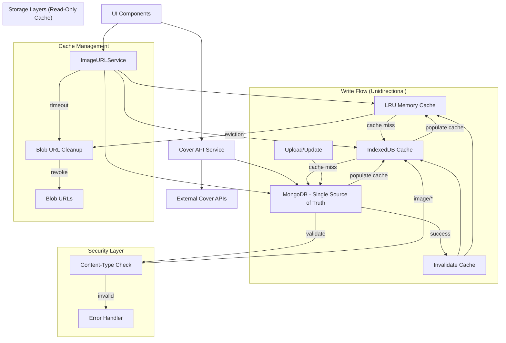

# Comic Covers Feature Design

## Overview

The comic covers feature will enhance the comic collection tracker by adding visual elements through cover image display, upload, and management capabilities. The design focuses on performance, user experience, and scalability while integrating seamlessly with the existing application architecture.

## Architecture Decisions

### Core Principle: Unidirectional Data Flow

This design follows a **strict unidirectional data flow** pattern:

```
User Action → MongoDB API → Cache Invalidation → UI Update
```

**What This Means:**
- MongoDB Atlas is the **single source of truth**
- All writes (upload, update, delete) go through MongoDB API first
- IndexedDB and memory caches are **read-only** - they never write back to MongoDB
- Caches are invalidated/updated after successful MongoDB operations
- No sync conflicts, no offline writes, no conflict resolution needed

**What This Eliminates:**
- ❌ No bidirectional sync
- ❌ No conflict resolution
- ❌ No offline write support
- ❌ No "local-first" mutations
- ❌ No background sync jobs

**What This Provides:**
- ✅ Simple, predictable data flow
- ✅ No sync conflicts ever
- ✅ Guaranteed consistency
- ✅ Easier debugging and testing
- ✅ Performance through read caching only

### Key Design Decisions Made

**1. Database Architecture**
- **Decision**: Unidirectional data flow - MongoDB Atlas as single source of truth
- **Rationale**: Eliminates sync conflicts, ensures data consistency, simpler implementation
- **Implementation**: All write operations go through MongoDB API → Cache invalidation → UI refresh
- **Trade-off**: Requires network connection for mutations (acceptable for this use case)

**2. Image Storage Strategy**
- **Decision**: MongoDB Atlas document storage (no GridFS)
- **Rationale**: Images under 5MB, simpler than GridFS, leverages existing MongoDB setup
- **Implementation**: `cover_images` collection with base64 encoded images
- **Cross-device**: Server-side storage ensures accessibility across devices/sessions

**3. Data Type Standards**
- **Decision**: Numeric IDs and years, string series/issueNumbers/publishers
- **Rationale**: Optimal performance for indexing and queries
- **Implementation**: Automatic normalization via API endpoints

**4. RESTful API Structure**
- **Decision**: Standard REST endpoints with proper HTTP methods
- **Rationale**: Industry standards, better maintainability, clear semantics
- **Implementation**: `/api/comics/[id]`, `/api/images/{comicId}/{size}`

**5. Simplified Image Storage**
- **Decision**: Two-layer architecture - Memory/IndexedDB cache + MongoDB API
- **Rationale**: Eliminates sync complexity while maintaining performance and reliability
- **Implementation**: Centralized ImageURLService with dynamic URL resolution

**6. Image Reference Storage**
- **Decision**: Store image identifiers, not blob URLs in comic records
- **Rationale**: Blob URLs become invalid after page reload causing errors
- **Implementation**: Comics store coverId, UI resolves to URLs dynamically

**7. Safe-by-Default API Design**
- **Decision**: Auto-revoke blob URLs by default with explicit unsafe alternatives
- **Rationale**: Prevents memory leaks from accumulated blob URLs
- **Implementation**: getImageUrl() auto-revokes, getImageUrlUnsafe() for manual management

**8. Content-Type Security Validation**
- **Decision**: Validate response content-type headers before processing
- **Rationale**: Prevents security vulnerabilities from malicious non-image responses
- **Implementation**: Strict image/* content-type checking with configurable validation

**9. Intelligent Cache Management**
- **Decision**: LRU cache with cleanup callbacks and per-size cache handling
- **Rationale**: Prevents memory leaks and ensures efficient resource utilization
- **Implementation**: Automatic eviction with blob URL cleanup and size-specific caching

### Implemented Architecture (Current)



### Key Improvements Implemented

#### 1. Safe-by-Default API Design
- `getImageUrl()`: Auto-revokes blob URLs after timeout (default 30s)
- `getImageUrlUnsafe()`: Manual blob URL management for advanced use cases
- Automatic cleanup prevents memory leaks from accumulated blob URLs

#### 2. Security Enhancements
- Content-type validation prevents processing non-image responses
- Configurable validation with strict image/* checking
- Protection against malicious server responses

#### 3. Performance Optimizations
- LRU cache with automatic eviction and cleanup callbacks
- Per-size cache handling (thumbnail, medium, full)
- Race condition prevention through request deduplication
- Intelligent cache invalidation based on timestamps

#### 4. Reliability Features
- Timeout handling for slow/hanging requests
- Comprehensive error handling with graceful fallbacks
- Standardized cache field names (cachedAt) across all layers
- Proper blob URL lifecycle management

#### 5. Environment Compatibility
- SSR-safe base64 decoding with atob/Buffer fallback for Node.js compatibility
- HMR-safe singleton preservation using globalThis storage
- Browser environment detection and graceful API degradation
- Development-friendly hot reload state preservation

#### 6. Developer Experience Enhancements
- Intuitive `release()` alias for `revokeUrl()` method for clearer resource management
- Self-documenting API methods that clearly express intent
- Consistent resource management patterns following acquire/release paradigms
- Backward compatibility maintained while improving ergonomics

### Data Flow

#### Read Flow (Cached)
1. UI requests cover via `ImageURLService.getImageUrl(comicId, size)`
2. Check LRU memory cache → if hit, return blob URL
3. Check IndexedDB cache → if hit, create blob URL, cache in memory, return
4. Fetch from MongoDB API `/api/images/{comicId}/{size}`
5. Validate content-type for security
6. Store in IndexedDB cache
7. Create blob URL, cache in memory
8. Return blob URL to UI

#### Write Flow (Unidirectional)
1. User uploads/updates cover
2. POST to MongoDB API `/api/images/upload` with image data
3. MongoDB processes and stores image in `cover_images` collection
4. MongoDB updates comic document with denormalized metadata:
   - `hasCover = true`
   - `coverSource`, `coverSourceProvider`, `coverLastUpdated`, etc.
   - Note: NO `coverId` field (would create bidirectional relationship)
5. API returns success with image metadata
6. **Invalidate caches**: Clear IndexedDB and memory cache for this comicId
7. UI refreshes and fetches new image (goes through read flow above)

**Key Point**: Comic document stores denormalized metadata for performance, but `cover_images` collection is authoritative. If there's a mismatch, `cover_images` wins.

#### Delete Flow (Unidirectional)
1. User deletes cover
2. DELETE to MongoDB API `/api/images/{comicId}`
3. MongoDB removes document from `cover_images` collection (by comicId)
4. MongoDB updates comic document to clear denormalized metadata:
   - `hasCover = false`
   - `coverSource = null`, `coverSourceProvider = null`, etc.
5. API returns success
6. **Invalidate caches**: Clear IndexedDB and memory cache for this comicId
7. UI refreshes and shows placeholder

**Key Point**: Delete finds cover by `comicId` in `cover_images` collection. No `coverId` needed in comic document.

**Key Point**: Caches are **never** the source for writes. They are invalidated after MongoDB operations complete.

### Cache Invalidation Strategy

The cache needs to know when images have been updated to avoid serving stale data.

#### Version Tracking

All image responses include version metadata:

```typescript
interface ImageResponse {
  imageId: string
  comicId: string
  version: string        // Hash of image data or incrementing version
  updatedAt: string      // ISO timestamp
  size: 'thumbnail' | 'medium' | 'full'
  data: Blob | ArrayBuffer
}
```

#### Cache Validation Flow

1. **On Cache Hit**: Check if cached version is current
   ```typescript
   const cached = await indexedDB.get(cacheKey)
   if (cached) {
     // Check version with lightweight HEAD request or metadata endpoint
     const metadata = await fetch(`/api/images/${comicId}/metadata`)
     const { version, updatedAt } = await metadata.json()
     
     if (cached.version === version) {
       return cached.data  // Cache is current
     } else {
       // Cache is stale, invalidate and refetch
       await indexedDB.delete(cacheKey)
       return fetchFromAPI()
     }
   }
   ```

2. **On Write Operations**: Explicit invalidation
   ```typescript
   // After successful upload/update/delete
   await ImageURLService.clearCache(comicId)  // Clear all sizes
   ```

3. **Periodic Validation**: Optional background check
   ```typescript
   // Check cache freshness periodically (e.g., on app startup)
   const cacheAge = Date.now() - cached.cachedAt
   if (cacheAge > MAX_CACHE_AGE) {
     // Validate or invalidate
   }
   ```

#### API Endpoints for Cache Validation

```typescript
// Lightweight metadata check (no image data)
GET /api/images/{comicId}/metadata
Response: {
  comicId: string
  versions: {
    thumbnail: { version: string, updatedAt: string, size: number }
    medium: { version: string, updatedAt: string, size: number }
    full: { version: string, updatedAt: string, size: number }
  }
}

// Conditional GET with ETag
GET /api/images/{comicId}/{size}
Headers: If-None-Match: "{version-hash}"
Response: 
  - 304 Not Modified (if version matches)
  - 200 OK with image data (if version changed)
```

#### Version Generation Strategies

**Option 1: Content Hash** (Recommended)
```typescript
version = sha256(imageData).substring(0, 16)
// Pros: Deterministic, detects any change
// Cons: Requires hashing on upload
```

**Option 2: Timestamp**
```typescript
version = updatedAt.toISOString()
// Pros: Simple, no computation
// Cons: Clock skew issues, less precise
```

**Option 3: Incrementing Counter**
```typescript
version = `v${counter++}`
// Pros: Simple, ordered
// Cons: Requires state management
```

#### Cache Invalidation Triggers

1. **Explicit Invalidation** (after mutations):
   - After upload: Clear cache for comicId
   - After update: Clear cache for comicId
   - After delete: Clear cache for comicId

2. **Implicit Invalidation** (on read):
   - Version mismatch detected
   - Cache entry expired (TTL)
   - Corrupted cache entry

3. **Manual Invalidation** (user-triggered):
   - "Refresh cover" button
   - "Clear cache" in settings
   - App restart (optional)

### Denormalization Strategy

To avoid bidirectional relationships while maintaining query performance:

**Authoritative Data** (in `cover_images` collection):
- Image binary data (thumbnail, medium, full)
- Source and attribution metadata
- `comicId` reference (unidirectional: CoverImage → Comic)

**Denormalized Data** (in `comics` collection):
- `hasCover: boolean` - for quick filtering without joining
- `coverSource`, `coverSourceProvider` - for display without joining
- `coverLastUpdated` - for cache invalidation decisions
- `coverAttribution` - for display without joining

**Rules**:
1. `cover_images` collection is authoritative for all cover data
2. Comic document stores copies for performance only
3. If there's a mismatch, `cover_images` wins
4. Updates to covers must update both collections atomically
5. Queries for "does comic have cover?" use `hasCover` flag (fast)
6. Queries for "get cover image" use `cover_images.findOne({ comicId })` (authoritative)

**Why No `coverId` in Comic?**
- Would create bidirectional relationship (Comic ↔ CoverImage)
- Two sources of truth for the relationship
- Sync issues if they get out of sync
- Instead: CoverImage has `comicId`, Comic has denormalized metadata
- Relationship is unidirectional: CoverImage → Comic

## Components and Interfaces

### Frontend Components

#### 1. CoverImage Component
```typescript
interface CoverImageProps {
  comicId: string
  size: 'thumbnail' | 'medium' | 'full'
  fallback?: string
  onClick?: () => void
  lazy?: boolean
}
```

**Responsibilities:**
- Display cover images with appropriate sizing
- Handle loading states and error fallbacks
- Support lazy loading for performance
- Provide click handlers for full-size viewing

#### 2. CoverUploader Component
```typescript
interface CoverUploaderProps {
  comicId: string
  onUploadComplete: (imageUrl: string) => void
  onUploadError: (error: string) => void
  acceptedFormats: string[]
  maxFileSize: number
}
```

**Responsibilities:**
- Handle file selection and validation
- Display upload progress
- Process and resize images before upload
- Provide drag-and-drop functionality

#### 3. CollectionView Component
```typescript
interface CollectionViewProps {
  comics: Comic[]
  onRemove: (comicId: string) => void
  onEdit: (updatedComic: Comic) => Promise<void>
}
```

**Responsibilities:**
- Display comics in list or grid view modes
- Integrate ViewModeToggle for switching between views
- Show cover images with CoverImage component
- Provide search and filtering capabilities
- Handle comic selection to open ComicDetailView
- Support inline editing (quick edit without opening detail view)
- Display cover statistics (X with covers, Y without covers, Z% coverage)
- Implement sorting (by series, issue, publisher, cover status, date added)

**View Modes:**
- **List View**: Comics grouped by series, shows covers alongside details
- **Grid View**: Cover-focused gallery using CoverGallery component

#### 3a. CoverGallery Component
```typescript
interface CoverGalleryProps {
  comics: Comic[]
  searchTerm: string
  sortBy: string
  onCoverClick: (comic: Comic) => void
  onEdit: (comic: Comic) => void
  onRemove: (comicId: string) => void
}
```

**Responsibilities:**
- Display comics in grid layout emphasizing cover images
- Implement virtual scrolling for large collections (1000+ comics)
- Handle cover click to open ComicDetailView
- Show comic info overlay on hover
- Provide quick action buttons (edit, delete)
- Lazy load images for performance

#### 3b. ViewModeToggle Component
```typescript
interface ViewModeToggleProps {
  viewMode: 'list' | 'grid'
  onViewModeChange: (mode: 'list' | 'grid') => void
}
```

**Responsibilities:**
- Toggle button for switching between list and grid views
- Persist user preference to localStorage
- Visual indicator of current mode
- Accessible keyboard navigation

#### 4. ComicDetailView Component
```typescript
interface ComicDetailViewProps {
  comic: Comic
  comics: Comic[]  // For autocomplete
  onClose: () => void
  onSave: (updatedComic: Comic) => Promise<void>
  onDelete: (comicId: string) => void
}
```

**Responsibilities:**
- Display comic details in a modal overlay
- Show large cover image (full size: 300x450px)
- Display all comic metadata (series, issue, publisher, year, variant, notes, date added)
- Provide edit mode for updating comic information
- Integrate cover management (add/replace/delete)
- Support autocomplete for series and publisher fields
- Handle cover upload via CoverUploader integration
- Handle cover search via CoverSelector integration (API-based)
- Invalidate caches after cover changes
- Close on outside click or close button
- Responsive design for mobile and desktop

**Cover Management Flow:**
1. User clicks "Add Cover" or "Replace Cover"
2. Show options: "Upload File" or "Search API"
3. If Upload: Open CoverUploader in nested modal
4. If Search: Open CoverSelector with comic metadata
5. On cover selection/upload: Save to MongoDB
6. Invalidate cache for comicId
7. Refresh UI with new cover

#### 5. CoverSelector Component
```typescript
interface CoverSelectorProps {
  coverResults: CoverResult[]
  onCoverSelect: (cover: CoverResult) => Promise<void>
  onCancel: () => void
  isVisible: boolean
  comicInfo: { series: string, issue: string, publisher?: string }
}
```

**Responsibilities:**
- Display search results from external cover APIs
- Show preview thumbnails of available covers
- Allow user to select preferred cover
- Download selected cover from API
- Handle attribution and licensing information
- Provide fallback if download fails
- Show loading states during download

### Backend Services

#### 1. ImageURLService (Centralized)
```typescript
interface ImageURLService {
  // Safe-by-default methods (auto-revoke)
  getImageUrl(comicId: string, size: ImageSize, options?: ImageOptions): Promise<string>
  preloadImage(comicId: string, size?: ImageSize): Promise<void>
  
  // Unsafe methods (manual management)
  getImageUrlUnsafe(comicId: string, size: ImageSize, options?: ImageOptions): Promise<string>
  revokeImageUrl(url: string): void
  
  // Cache management
  clearCache(comicId?: string): Promise<void>
  getCacheStats(): Promise<CacheStats>
  
  // Cache validation
  validateCacheVersion(comicId: string, size: ImageSize): Promise<boolean>
  getImageMetadata(comicId: string): Promise<ImageMetadata>
  isCacheStale(comicId: string, size: ImageSize): Promise<boolean>
  
  // Utility methods
  validateContentType(response: Response): boolean
  generateCacheKey(comicId: string, size: ImageSize): string
}

interface ImageOptions {
  timeout?: number
  validateContentType?: boolean
  fallbackToPlaceholder?: boolean
  skipCacheValidation?: boolean  // Skip version check for performance
}

interface CacheStats {
  memoryCache: { size: number, entries: number }
  indexedDBCache: { size: number, entries: number }
  totalBlobUrls: number
  staleEntries: number  // Entries with outdated versions
}

interface ImageMetadata {
  comicId: string
  versions: {
    thumbnail: VersionInfo
    medium: VersionInfo
    full: VersionInfo
  }
  source: 'upload' | 'api' | 'manual'
  createdAt: string
  updatedAt: string
}

interface VersionInfo {
  version: string
  updatedAt: string
  size: number
  dimensions: { width: number, height: number }
}
```

#### 2. MongoDB Image Service
```typescript
interface MongoImageService {
  storeCoverImages(comicId: string, images: ProcessedImages, metadata: ImageMetadata): Promise<ObjectId>
  getCoverImages(comicId: string): Promise<CoverImageDocument | null>
  getCoverImage(comicId: string, size: 'thumbnail' | 'medium' | 'full'): Promise<ImageData | null>
  deleteCoverImages(comicId: string): Promise<boolean>
  updateCoverImages(comicId: string, images: Partial<ProcessedImages>): Promise<boolean>
  findCoversBySource(source: string): Promise<CoverImageDocument[]>
}

interface ProcessedImages {
  thumbnail: ImageData
  medium: ImageData
  full: ImageData
}

interface ImageData {
  data: Buffer | string  // Binary data or base64 string
  mimeType: string
  size: number
  dimensions: { width: number, height: number }
}

interface ImageMetadata {
  source: 'upload' | 'api' | 'manual'
  sourceDetails?: {
    apiProvider?: string
    originalUrl?: string
    attribution?: string
    licenseInfo?: string
  }
}
```

#### 2. Cover API Service
```typescript
interface CoverAPIService {
  searchCovers(series: string, issue: string, publisher?: string, year?: string): Promise<CoverResult[]>
  downloadCover(coverUrl: string, comicId: string): Promise<string>
  getCoverMetadata(coverUrl: string): Promise<CoverMetadata>
}

interface CoverResult {
  id: string
  imageUrl: string
  thumbnailUrl: string
  provider: string
  providerName: string
  attribution: string
  quality: 'low' | 'medium' | 'high'
  dimensions: { width: number, height: number }
  variant?: string
  licenseInfo?: string
  metadata: {
    title: string
    issueNumber: string
    publisher: string
    coverDate: string | null
    year: number | null
    apiId: string
    originalUrl?: string
  }
}

/**
 * Cover Search Strategy (Updated 2025-11-20)
 * 
 * Two-Step Approach for Accurate Results:
 * 
 * Step 1: Volume Search
 * - Search ComicVine for volumes (series) matching the series name
 * - Returns most relevant series first (e.g., "Web of Spider-Man" 1985, 2009, 2024)
 * - Get volume IDs for matching series
 * 
 * Step 2: Issue Query
 * - Query for specific issue number within those volumes
 * - Much smaller result set (2-10 results vs 13,816)
 * - Sorted by cover date descending (newest first)
 * 
 * Why This Works Better:
 * - Previous approach: Fetched ALL comics with issue #X (13,816 results for issue #11)
 * - Problem: Desired comic buried deep in results, false positives from word matching
 * - Solution: Search volumes first, then query issues within those volumes
 * - Result: Accurate matches, no false positives, faster response
 * 
 * Example: "Web of Spider-Man" #11
 * - Old: Returned "Casper" and other unrelated comics
 * - New: Returns Web of Spider-Man (2010) and (1986) correctly
 */
```

#### 3. LRU Cache Service
```typescript
interface LRUCacheService {
  get(key: string): string | null
  set(key: string, value: string, cleanupCallback?: () => void): void
  delete(key: string): boolean
  clear(): void
  size(): number
  keys(): string[]
  
  // Configuration
  setMaxSize(size: number): void
  getMaxSize(): number
  
  // Statistics
  getStats(): { hits: number, misses: number, evictions: number }
}
```

## Database Architecture

### MongoDB Schema Design

#### Cover Images Collection
Since comic covers are typically under 1MB (well below MongoDB's 16MB document limit), we can store them directly as Binary data in documents:

```typescript
interface CoverImageDocument {
  _id: ObjectId
  comicId: string
  images: {
    thumbnail: {
      data: BinData        // Base64 or Binary data
      mimeType: string     // 'image/jpeg', 'image/png', etc.
      size: number         // File size in bytes
      dimensions: { width: number, height: number }
      version: string      // Hash or version identifier for cache validation
    }
    medium: {
      data: BinData
      mimeType: string
      size: number
      dimensions: { width: number, height: number }
      version: string
    }
    full: {
      data: BinData
      mimeType: string
      size: number
      dimensions: { width: number, height: number }
      version: string
    }
  }
  source: 'upload' | 'api' | 'manual'
  sourceDetails: {
    apiProvider?: string
    originalUrl?: string
    downloadedAt?: Date
    attribution?: string
    licenseInfo?: string
  }
  createdAt: Date
  updatedAt: Date
}

// Relationship Model:
// - CoverImage has comicId (CoverImage → Comic)
// - Comic does NOT have coverId (no Comic → CoverImage)
// - This is unidirectional: CoverImage knows about Comic, Comic doesn't know about CoverImage
// - To find cover for comic: db.cover_images.findOne({ comicId: comic.id })
// - Comic.hasCover is denormalized for performance, but cover_images is authoritative
```

### Storage Strategy

#### Unidirectional Read-Through Cache
1. **Single Source of Truth**: MongoDB Atlas is authoritative
2. **Read-Only Cache**: IndexedDB caches images fetched from MongoDB
3. **No Local Writes**: All mutations go through MongoDB API first
4. **Cache Invalidation**: Cache cleared/updated after successful MongoDB writes

#### Storage Tiers
1. **Hot Storage**: Recently accessed images in memory cache (LRU)
2. **Warm Storage**: Frequently accessed images in IndexedDB (read-through cache)
3. **Cold Storage**: All images in MongoDB document storage (authoritative)
4. **No Offline Writes**: Requires network connection for mutations

## Data Models

### Cover Image Model
```typescript
interface CoverImage {
  id: string
  comicId: string
  originalUrl: string
  thumbnailUrl: string
  mediumUrl: string
  fullUrl: string
  fileSize: number
  dimensions: {
    width: number
    height: number
  }
  format: 'jpeg' | 'png' | 'webp'
  source: 'upload' | 'api' | 'manual'
  sourceDetails: {
    apiProvider?: 'comicvine' | 'marvel' | 'dc' | 'custom'
    originalDownloadUrl?: string
    downloadedAt?: Date
    apiId?: string
    attribution?: string
    licenseInfo?: string
  }
  uploadedAt: Date
  lastUpdated: Date
  metadata?: {
    artist?: string
    variant?: string
    quality?: number
    description?: string
  }
}
```

### Comic Model Extension
```typescript
interface Comic {
  // ... existing fields
  
  // Cover metadata stored in comic document for quick access and filtering
  // Actual image data stored separately in cover_images collection
  // Relationship: CoverImage.comicId → Comic.id (unidirectional)
  
  // NO coverId field - this would create bidirectional relationship
  // To check if comic has cover: Query cover_images collection by comicId
  // Or use denormalized hasCover flag for quick filtering
  
  hasCover: boolean                 // Denormalized flag for quick UI filtering
  coverSource: 'upload' | 'api' | 'manual' | null  // Denormalized for display
  coverSourceProvider: string | null  // Denormalized for display
  coverOriginalUrl: string | null   // For re-fetching from API
  coverLastUpdated: Date | null     // Denormalized for cache invalidation
  coverAttribution: string | null   // Denormalized for display
  
  // NOTE: These are denormalized copies from cover_images collection
  // They are updated when cover_images changes, but cover_images is authoritative
  // If there's a mismatch, cover_images wins
  
  // NEVER STORED:
  // - coverUrl (resolved dynamically by UI via ImageURLService)
  // - coverId (would create bidirectional relationship)
}
```

### Image Processing Configuration
```typescript
interface ImageConfig {
  thumbnailSize: { width: 150, height: 225 }
  mediumSize: { width: 300, height: 450 }
  maxFileSize: 5 * 1024 * 1024 // 5MB
  supportedFormats: ['image/jpeg', 'image/png', 'image/webp']
  compressionQuality: 0.85
  cacheExpiry: 7 * 24 * 60 * 60 * 1000 // 7 days
}
```

## Cover Source Management

### Dual Cover Source Strategy

The application provides two methods for adding cover images, giving users flexibility based on their needs:

#### 1. File Upload (via CoverUploader)
**Use Case**: Rare comics, custom covers, scanned images
**Process**:
- User selects image file from local device
- Client-side validation (format, size)
- Image processing (resize, compress, generate thumbnails)
- Upload to MongoDB via API
- Store with `source: 'upload'`

**Supported Formats**: JPEG, PNG, WebP
**Max File Size**: 5MB
**Processing**: Automatic thumbnail generation (150x225, 300x450)

#### 2. API Search (via CoverSelector)
**Use Case**: Popular comics with existing cover art
**Process**:
- User clicks "Search API"
- App searches external APIs using comic metadata (series, issue, publisher)
- Display preview thumbnails of available covers
- User selects preferred cover
- Download and process selected cover
- Upload to MongoDB via API
- Store with `source: 'api'` and provider information

**Supported APIs**: ComicVine, Marvel API, DC API (configurable)
**Attribution**: Automatically tracked and displayed
**Fallback**: If API fails, offer upload option

### User Interface Flow

```
Comic Detail View
  ↓
Click "Add/Replace Cover"
  ↓
┌─────────────────────────────┐
│  Choose Cover Source:       │
│  ┌───────────┐ ┌──────────┐│
│  │  Upload   │ │ Search   ││
│  │   File    │ │   API    ││
│  └───────────┘ └──────────┘│
└─────────────────────────────┘
  ↓                    ↓
CoverUploader      CoverSelector
  ↓                    ↓
Upload to MongoDB ← Download & Upload
  ↓
Cache Invalidation
  ↓
UI Refresh
```

### Source Tracking and Attribution

The system maintains detailed records of where each cover image originated:

- **Upload Source**: User-uploaded images with original filename and upload timestamp
- **API Source**: Downloaded from external APIs with provider information, original URL, and attribution requirements
- **Manual Source**: Manually entered URLs with source tracking (legacy/deprecated)

### Attribution Display
- Show image source information in cover details/metadata view
- Display required attribution text for API-sourced images
- Provide links back to original sources when appropriate
- Respect licensing requirements from different providers

### Re-fetch Capabilities
- Store original download URLs to enable re-fetching updated covers
- Track API IDs to check for higher quality versions
- Implement version checking for covers from external sources
- Allow users to refresh covers from original sources

### Source Migration
- Support changing cover sources (e.g., replacing uploaded image with API version)
- Maintain history of source changes
- Preserve attribution information across source changes

## API Endpoints

### Cover Search Endpoints

#### Search for Covers (External API)
```
GET /api/cover-search
Parameters:
- series: string (required) - Comic series name
- issue: string (required) - Issue number
- publisher: string (optional) - Publisher name
- year: string (optional) - Publication year

Implementation Strategy (Updated 2025-11-20):
Uses two-step approach for accurate results:

Step 1: Volume Search
  GET https://comicvine.gamespot.com/api/search/
  - resources=volume
  - query={series}
  - Returns matching series/volumes with IDs

Step 2: Issue Query
  GET https://comicvine.gamespot.com/api/issues/
  - filter=volume:{ids},issue_number:{issue}
  - Returns specific issues within those volumes
  - Sorted by cover_date descending

Response:
{
  "success": true,
  "results": [
    {
      "id": "string",
      "imageUrl": "string",
      "thumbnailUrl": "string",
      "quality": "medium",
      "dimensions": { "width": number, "height": number },
      "variant": "string",
      "provider": "comicvine",
      "providerName": "Comic Vine",
      "attribution": "string",
      "licenseInfo": "string",
      "metadata": {
        "title": "string",
        "issueNumber": "string",
        "publisher": "string",
        "coverDate": "YYYY-MM-DD",
        "year": number,
        "apiId": "string",
        "originalUrl": "string"
      }
    }
  ],
  "total": number,
  "query": {
    "series": "string",
    "issue": "string",
    "publisher": "string"
  }
}

Error Response:
{
  "error": "string",
  "details": "string"
}

Status Codes:
- 200 OK: Search successful
- 400 Bad Request: Missing required parameters
- 500 Internal Server Error: API error or network failure

Notes:
- Requires COMICVINE_API_KEY environment variable
- Results filtered by series name matching (all significant words must match)
- Normalized title matching handles punctuation and articles
- Returns up to 10 results per search
```

### Image Management Endpoints

#### Upload Image
```
POST /api/images/upload
Content-Type: multipart/form-data

Body:
- file: Image file
- comicId: string
- source: 'upload' | 'api' | 'manual'
- metadata: JSON string (optional)

Response:
{
  "success": true,
  "imageId": "ObjectId",
  "comicId": "string",
  "versions": {
    "thumbnail": { 
      "version": "abc123...",
      "updatedAt": "2023-11-07T12:00:00Z",
      "size": 15360
    },
    "medium": { 
      "version": "def456...",
      "updatedAt": "2023-11-07T12:00:00Z",
      "size": 81920
    },
    "full": { 
      "version": "ghi789...",
      "updatedAt": "2023-11-07T12:00:00Z",
      "size": 245760
    }
  },
  "urls": {
    "thumbnail": "/api/images/{comicId}/thumbnail",
    "medium": "/api/images/{comicId}/medium", 
    "full": "/api/images/{comicId}/full"
  }
}
```

#### Get Image
```
GET /api/images/{comicId}/{size}
Parameters:
- comicId: string
- size: 'thumbnail' | 'medium' | 'full'

Request Headers (optional):
- If-None-Match: "{version-hash}"  // For conditional GET

Response: Binary image data with appropriate Content-Type
Headers:
- Content-Type: image/jpeg | image/png | image/webp
- Cache-Control: public, max-age=31536000
- ETag: "{version-hash}"           // For cache validation
- X-Image-Version: "{version}"     // Explicit version
- X-Updated-At: "{ISO-timestamp}"  // Last update time
- Content-Length: {file-size}

Status Codes:
- 200 OK: Image data returned
- 304 Not Modified: If-None-Match matches current version
- 404 Not Found: No cover for this comic
```

#### Delete Image
```
DELETE /api/images/{comicId}
Response:
{
  "success": true,
  "deletedSizes": ["thumbnail", "medium", "full"]
}
```

#### Get Image Metadata
```
GET /api/images/{comicId}/metadata
Response:
{
  "comicId": "string",
  "source": "upload",
  "versions": {
    "thumbnail": { 
      "version": "abc123...",
      "updatedAt": "2023-11-07T12:00:00Z",
      "size": 15360, 
      "dimensions": { "width": 150, "height": 225 } 
    },
    "medium": { 
      "version": "def456...",
      "updatedAt": "2023-11-07T12:00:00Z",
      "size": 81920, 
      "dimensions": { "width": 300, "height": 450 } 
    },
    "full": { 
      "version": "ghi789...",
      "updatedAt": "2023-11-07T12:00:00Z",
      "size": 245760, 
      "dimensions": { "width": 800, "height": 1200 } 
    }
  },
  "createdAt": "2023-11-07T11:00:00Z",
  "updatedAt": "2023-11-07T12:00:00Z"
}

// Use this endpoint for lightweight cache validation
// without downloading full image data
```


## Error Handling

### Image Upload Errors
- **File too large**: Display size limit and suggest compression
- **Invalid format**: Show supported formats and conversion options
- **Upload failure**: Retry mechanism with exponential backoff
- **Processing error**: Clear error message with troubleshooting steps

### Cover Fetching Errors
- **API unavailable**: Graceful fallback to manual upload
- **No covers found**: Suggest alternative search terms or manual upload
- **Download failure**: Retry with different sources or manual fallback
- **Rate limiting**: Queue requests and inform user of delays

### Display Errors
- **Image load failure**: Show fallback placeholder with retry option
- **Corrupted image**: Detect and offer re-upload or re-fetch
- **Cache errors**: Clear cache and reload from source
- **Performance issues**: Implement progressive loading and optimization

## Testing Strategy

### Unit Tests
- Image processing functions (resize, compress, format conversion)
- Cache management operations
- API service methods
- Component rendering with different props

### Integration Tests
- End-to-end upload workflow
- Cover fetching and caching flow
- View mode switching and persistence
- Error handling scenarios

### Performance Tests
- Large collection rendering (1000+ comics with covers)
- Image loading and caching performance
- Memory usage with multiple high-resolution images
- Network performance with slow connections

### User Experience Tests
- Upload flow usability
- Cover selection and management
- Mobile responsiveness
- Accessibility compliance (alt text, keyboard navigation)

## Implementation Phases

### Phase 1: Core Infrastructure
- Image storage service setup (IndexedDB)
- Basic cover display component
- File upload functionality
- Thumbnail generation

### Phase 2: Cover Management
- Cover upload UI
- Image processing and optimization
- Basic caching implementation
- Error handling

### Phase 3: Backend Storage Integration
- MongoDB document storage setup
- REST API endpoints for image operations
- Server-side image processing
- Hybrid storage strategy implementation

### Phase 4: Auto-fetch Integration
- External API integration
- Cover search and selection
- Automatic cover assignment
- Batch processing for existing comics

### Phase 5: Enhanced UI/UX
- Grid and list view modes
- Cover gallery and modal views
- Advanced image management
- Performance optimizations

### Phase 6: Advanced Features
- Bulk cover operations
- Cover metadata management
- Advanced caching strategies
- Analytics and monitoring

### Phase 7: Cloud Integration (Optional)
- Cloud storage providers (AWS S3, Google Cloud)
- CDN integration for image delivery
- Backup and redundancy systems
- Cost optimization strategies