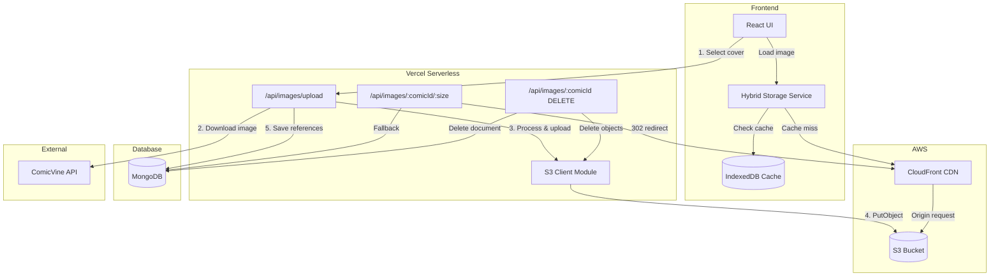
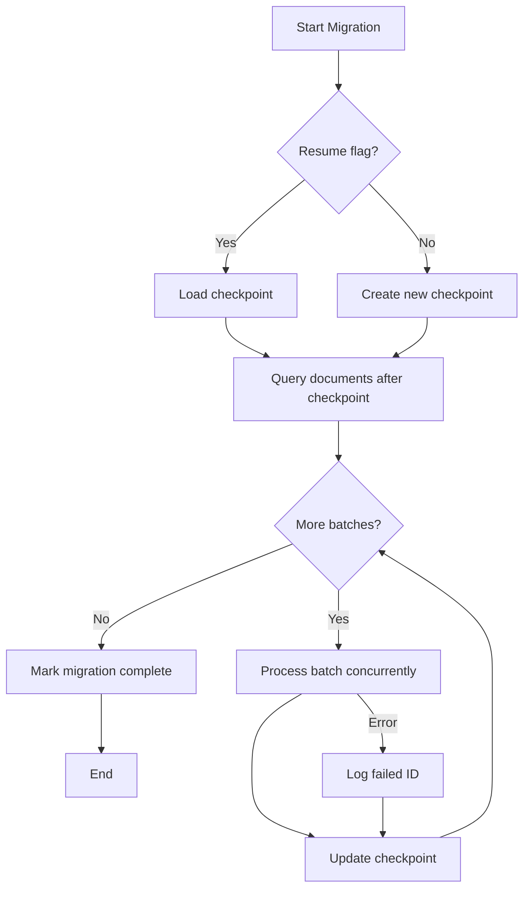
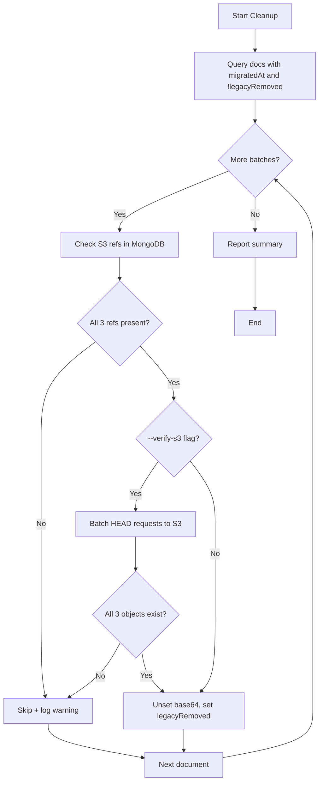

# Design Document: S3 Image Storage Migration

## Overview

This design describes the migration of comic cover image storage from MongoDB (base64-encoded binary data) to Amazon S3, while maintaining MongoDB as the metadata store. The architecture leverages CloudFront CDN for performant image delivery and preserves the existing offline-first hybrid storage pattern using IndexedDB.

### Goals
- Eliminate MongoDB's 16MB document size limit for images
- Reduce MongoDB storage costs and backup sizes
- Improve image delivery performance via CloudFront CDN
- Maintain backward compatibility during migration
- Preserve offline capabilities through IndexedDB caching

### Non-Goals
- Direct file upload from user's computer (ComicVine flow only)
- Real-time image processing (Lambda@Edge)
- Multi-region S3 replication

## Architecture



## Components and Interfaces

### 1. S3 Client Module (`api/s3-client.js`)

Centralized S3 operations using AWS SDK v3.

```javascript
interface S3ClientConfig {
  region: string;           // AWS_REGION
  bucket: string;           // AWS_S3_BUCKET
  publicBaseUrl: string;    // AWS_S3_PUBLIC_BASE_URL (CloudFront)
  distributionId: string;   // CLOUDFRONT_DISTRIBUTION_ID
}

interface S3ImageReference {
  key: string;              // covers/{comicId}/{size}.jpg
  url: string;              // CloudFront URL
  contentType: string;      // image/jpeg
  size: number;             // bytes
  etag: string;             // S3 ETag
  uploadedAt: string;       // ISO timestamp
}

class S3Client {
  // Upload image buffer to S3 with Cache-Control header
  // Sets: Content-Type from contentType param, Cache-Control: public, max-age=2592000
  async uploadImage(comicId: string, size: string, buffer: Buffer, contentType: string): Promise<S3ImageReference>
  
  // Delete all size variants for a comic
  async deleteImages(comicId: string): Promise<void>
  
  // Check if image exists
  async imageExists(comicId: string, size: string): Promise<boolean>
  
  // Invalidate CloudFront cache for a comic's images
  async invalidateCache(comicId: string): Promise<void>
  
  // Generate S3 key
  keyFor(comicId: string, size: string): string  // covers/{comicId}/{size}.jpg
  
  // Generate public URL
  urlFor(key: string): string  // {publicBaseUrl}/{key}
  
  // Check if S3 is configured
  isConfigured(): boolean
}
```

### 2. Backend Upload Service (`api/images/upload.js`)

Modified to support S3 storage with MongoDB fallback.

```javascript
interface UploadRequest {
  comicId: string;
  imageUrl: string;         // ComicVine image URL
  metadata: {
    source: string;         // 'api'
    provider: string;       // 'comicvine'
    volumeId?: string;
    volumeName?: string;
  };
}

interface UploadResponse {
  success: boolean;
  comicId: string;
  images: {
    thumbnail: S3ImageReference;
    medium: S3ImageReference;
    full: S3ImageReference;
  };
  storage: 'S3' | 'MongoDB';
}
```

**Flow:**
1. Receive upload request with ComicVine URL
2. Download image from ComicVine
3. Process into size variants using Sharp
4. If S3 configured: upload to S3, save references to MongoDB
5. If S3 not configured (dev): save base64 to MongoDB (legacy)
6. Return success with image URLs

### 3. Backend Image Retrieval (`api/images/[comicId]/[size].js`)

Modified to redirect to CloudFront or serve from MongoDB.

```javascript
// GET /api/images/{comicId}/{size}
async function handler(req, res) {
  const { comicId, size } = req.query;
  
  // Get cover_images document from MongoDB
  const coverDoc = await getCoverImages(comicId);
  
  if (coverDoc?.images?.[size]?.url) {
    // S3 path: redirect to CloudFront
    return res.redirect(302, coverDoc.images[size].url);
  }
  
  if (coverDoc?.images?.[size]?.data) {
    // Legacy path: serve base64 from MongoDB
    const buffer = Buffer.from(coverDoc.images[size].data, 'base64');
    res.setHeader('Content-Type', coverDoc.images[size].mimeType);
    return res.send(buffer);
  }
  
  return res.status(404).json({ error: 'Image not found' });
}
```

### 4. Backend Image Deletion (`api/images/[comicId].js`)

Modified to delete from S3 and MongoDB.

```javascript
// DELETE /api/images/{comicId}
async function handleDelete(req, res, comicId) {
  const s3Client = getS3Client();
  
  try {
    // Delete from S3 (if configured)
    if (s3Client.isConfigured()) {
      await s3Client.deleteImages(comicId);
    }
    
    // Delete from MongoDB
    await deleteCoverImages(comicId);
    
    // Update comic's hasCover flag
    await updateComic(comicId, { hasCover: false });
    
    return res.json({ success: true });
  } catch (error) {
    // Log orphaned S3 keys if MongoDB deletion failed
    if (error.phase === 'mongodb') {
      console.error('Orphaned S3 keys:', `covers/${comicId}/*`);
    }
    throw error;
  }
}
```

### 5. Frontend Hybrid Storage Service

Minimal changes - uses existing IndexedDB caching with S3/CloudFront URLs.

```javascript
// Existing flow works with S3 URLs:
// 1. Check IndexedDB cache by comicId
// 2. If miss, fetch from CloudFront URL (or API fallback)
// 3. Cache response in IndexedDB
// 4. Return blob URL

// On delete:
// 1. Call DELETE /api/images/{comicId}
// 2. Clear IndexedDB entry for comicId
```

## Data Models

### MongoDB `cover_images` Collection

**New Schema (S3):**
```javascript
{
  _id: ObjectId,
  comicId: string,              // Reference to comics collection
  images: {
    thumbnail: {
      key: string,              // covers/{comicId}/thumbnail.jpg
      url: string,              // CloudFront URL
      contentType: string,      // image/jpeg
      size: number,             // bytes
      etag: string,             // S3 ETag
      uploadedAt: string        // ISO timestamp
    },
    medium: { /* same structure */ },
    full: { /* same structure */ }
  },
  metadata: {
    source: string,             // 'api'
    provider: string,           // 'comicvine'
    originalUrl: string,        // ComicVine source URL
    volumeId: string,
    volumeName: string
  },
  migratedAt: string,           // Set after migration from base64
  legacyRemoved: boolean,       // Set after cleanup script
  createdAt: string,
  updatedAt: string
}
```

**Legacy Schema (MongoDB base64) - preserved during migration:**
```javascript
{
  _id: ObjectId,
  comicId: string,
  images: {
    thumbnail: {
      data: string,             // base64 encoded
      mimeType: string,
      size: number
    },
    medium: { /* same */ },
    full: { /* same */ }
  },
  metadata: { /* same */ },
  createdAt: string,
  updatedAt: string
}
```

### S3 Object Structure

```
s3://{bucket}/
  covers/
    {comicId}/
      thumbnail.jpg
      medium.jpg
      full.jpg
```

**Object Metadata:**
- `Content-Type: image/jpeg`
- `Cache-Control: public, max-age=2592000`
- `x-amz-meta-comic-id: {comicId}`
- `x-amz-meta-size: thumbnail|medium|full`


## Correctness Properties

*A property is a characteristic or behavior that should hold true across all valid executions of a system-essentially, a formal statement about what the system should do. Properties serve as the bridge between human-readable specifications and machine-verifiable correctness guarantees.*

Based on the acceptance criteria analysis, the following properties must hold:

### Property 1: Upload produces all size variants
*For any* valid image URL, when the Backend_Upload_Service processes an upload, it SHALL produce exactly three size variants (thumbnail, medium, full) and upload all three to S3.
**Validates: Requirements 1.2**

### Property 2: S3 references contain required fields
*For any* S3 image reference stored in MongoDB, it SHALL contain all required fields: key, url, contentType, size, etag, and uploadedAt timestamp.
**Validates: Requirements 1.4, 10.1**

### Property 3: Image retrieval returns correct URL for size
*For any* comic with S3-stored images and any valid size (thumbnail, medium, full), the Image_Retrieval_Service SHALL return the CloudFront URL corresponding to that specific size.
**Validates: Requirements 2.1, 2.2**

### Property 4: Retrieval fallback to MongoDB
*For any* comic without S3 URLs but with legacy base64 data, the Image_Retrieval_Service SHALL serve the image from MongoDB.
**Validates: Requirements 2.3**

### Property 5: Deletion removes all artifacts
*For any* cover deletion, the Image_Deletion_Service SHALL remove all three S3 size variants, delete the MongoDB cover_images document, and set the comic's hasCover flag to false.
**Validates: Requirements 3.1, 3.2, 3.3**

### Property 6: Deletion is idempotent
*For any* comicId, calling delete twice SHALL succeed without error (the second call is a no-op).
**Validates: Requirements 3.4**

### Property 7: IndexedDB cache uses comicId key
*For any* image cached in IndexedDB, the primary key SHALL be the comicId, and deletion SHALL clear the cache entry for that comicId.
**Validates: Requirements 4.1, 4.3**

### Property 8: Migration preserves legacy data
*For any* migrated document, the MongoDB document SHALL contain both S3 references AND the original base64 data, plus a migratedAt timestamp.
**Validates: Requirements 5.2, 5.3**

### Property 9: Cleanup requires complete S3 references
*For any* document, the Cleanup_Service SHALL only remove base64 data if valid S3 references exist for ALL three size variants (thumbnail, medium, full).
**Validates: Requirements 6.1, 6.2, 6.4**

### Property 10: S3 key pattern consistency
*For any* comicId and size, the S3 key SHALL follow the pattern `covers/{comicId}/{size}.jpg`.
**Validates: Requirements 7.4**

### Property 11: Environment-aware fallback
*For any* environment without AWS credentials, the S3_Client SHALL fall back to MongoDB in development/preview, but fail fast in production.
**Validates: Requirements 7.2, 7.3**

### Property 12: API redirect behavior
*For any* GET request to `/api/images/{comicId}/{size}`, the API SHALL return 302 redirect to CloudFront URL if S3 reference exists, otherwise serve from MongoDB.
**Validates: Requirements 8.1, 8.2**

### Property 13: Upload headers are correct
*For any* S3 upload, the object SHALL have Content-Type matching the image format and Cache-Control set to `public, max-age=2592000`.
**Validates: Requirements 9.2, 9.3, 11.4**

### Property 14: S3 reference round-trip consistency
*For any* S3ImageReference object, serializing to JSON then deserializing SHALL produce an equivalent object.
**Validates: Requirements 10.3**

### Property 15: CloudFront invalidation on replacement
*For any* cover replacement (not initial upload), the Backend_Upload_Service SHALL call CloudFront invalidation for the replaced comic's images.
**Validates: Requirements 11.6**

## Migration Script Design

### Script Interface

**File**: `scripts/migrate-images-to-s3.js`

```bash
# CLI Usage
node scripts/migrate-images-to-s3.js [options]

Options:
  --dry-run           Preview changes without writing to S3 or MongoDB
  --concurrency <n>   Number of concurrent uploads (default: 5)
  --resume            Resume from last checkpoint
  --only <comicId>    Migrate a single comic (for testing)
  --batch-size <n>    Documents per batch (default: 100)
  --verbose           Enable detailed logging
```

### Checkpoint Tracking

Checkpoints are stored in MongoDB `migrations` collection:

```javascript
{
  _id: ObjectId,
  name: 'images-to-s3',
  status: 'in_progress' | 'completed' | 'failed',
  lastProcessedId: ObjectId,     // Last successfully migrated document
  totalDocuments: number,
  migratedCount: number,
  skippedCount: number,
  failedCount: number,
  failedIds: [string],           // IDs that failed for manual review
  startedAt: string,
  updatedAt: string,
  completedAt: string
}
```

### Migration Flow



### Batch Processing Strategy

1. Query documents with legacy base64 data and no S3 references
2. Process in batches of 100 documents
3. For each document:
   - Extract base64 data for each size
   - Convert to Buffer
   - Upload to S3 with correct key pattern
   - Update MongoDB with S3 references (preserve base64)
   - Set `migratedAt` timestamp
4. Update checkpoint after each batch
5. On failure: log failed ID, continue with next document

### Dry-Run Mode

In dry-run mode:
- Query documents as normal
- Log what would be uploaded (key, size)
- Log what MongoDB updates would be made
- Do NOT write to S3 or MongoDB
- Report summary at end

## Cleanup Script Design

### Script Interface

**File**: `scripts/cleanup-legacy-images.js`

```bash
# CLI Usage
node scripts/cleanup-legacy-images.js [options]

Options:
  --dry-run           Preview changes without modifying MongoDB
  --verify-s3         HEAD request to verify S3 objects exist (slower but safer)
  --batch-size <n>    Documents per batch (default: 100)
  --concurrency <n>   Concurrent S3 HEAD requests (default: 10)
  --verbose           Enable detailed logging
```

### Cleanup Flow



### S3 Verification Strategy

When `--verify-s3` is enabled:
1. Collect all S3 keys for the batch (3 keys per document)
2. Execute HEAD requests with concurrency limit (default 10)
3. Group results by comicId
4. Only proceed with cleanup if all 3 sizes verified for a document

```javascript
// Batched S3 verification
async function verifyS3Objects(documents, concurrency = 10) {
  const allKeys = documents.flatMap(doc => [
    doc.images.thumbnail.key,
    doc.images.medium.key,
    doc.images.full.key
  ]);
  
  // Process with concurrency limit
  const results = await pMap(allKeys, key => s3Client.headObject(key), { concurrency });
  
  // Group by comicId and check all 3 exist
  return documents.map(doc => ({
    comicId: doc.comicId,
    allExist: [doc.images.thumbnail.key, doc.images.medium.key, doc.images.full.key]
      .every(key => results.find(r => r.key === key)?.exists)
  }));
}
```

### Partial Cleanup Handling

- Documents are processed independently
- If S3 verification fails for a document, it is skipped (not cleaned)
- Skipped documents are logged with reason
- Summary reports: cleaned count, skipped count, skip reasons
- Skipped documents can be retried in a subsequent run

### Cleanup Summary Output

```
Cleanup Summary:
  Total documents processed: 500
  Successfully cleaned: 485
  Skipped (missing S3 refs): 10
  Skipped (S3 verification failed): 5
  
Skipped documents logged to: cleanup-skipped-2024-12-18.json
```

## Error Handling

### Upload Errors

| Error Type | Handling | User Feedback |
|------------|----------|---------------|
| ComicVine download fails | Return 502, log error | "Failed to download cover from ComicVine. Please try again." |
| Sharp processing fails | Return 500, log error | "Failed to process image. The image may be corrupted." |
| S3 upload fails | Return 503, log error | "Failed to save cover. Please try again." |
| MongoDB save fails after S3 | Log orphaned keys, return 500 | "Failed to save cover metadata. Please try again." |

### Retrieval Errors

| Error Type | Handling | User Feedback |
|------------|----------|---------------|
| S3 redirect fails | Fall back to MongoDB | Transparent to user |
| MongoDB fallback fails | Return 404 | Show placeholder image |
| CloudFront 403/404 | Return 404 | Show placeholder image |

### Deletion Errors

| Error Type | Handling | User Feedback |
|------------|----------|---------------|
| S3 deletion fails | Log error, continue to MongoDB | "Cover partially deleted. Please try again." |
| MongoDB deletion fails after S3 | Log orphaned keys, return 500 | "Failed to complete deletion. Please try again." |
| S3 object not found | Continue (idempotent) | Transparent to user |

### Orphaned Resource Cleanup

When MongoDB operations fail after successful S3 operations, orphaned S3 keys are logged to a dedicated log stream. A periodic cleanup job (manual or scheduled) can:
1. Query logs for orphaned keys
2. Verify MongoDB state
3. Delete confirmed orphans from S3

## Testing Strategy

### Dual Testing Approach

This feature requires both unit tests and property-based tests:
- **Unit tests**: Verify specific examples, edge cases, and error conditions
- **Property-based tests**: Verify universal properties that should hold across all inputs

### Property-Based Testing Library

**Library**: [fast-check](https://github.com/dubzzz/fast-check) for JavaScript/TypeScript

**Configuration**: Each property test runs minimum 100 iterations.

**Test File Location**: `src/utils/__tests__/s3-image-storage.property.test.js`

### Property Test Annotations

Each property-based test MUST be tagged with:
```javascript
// **Feature: s3-image-storage, Property {number}: {property_text}**
```

### Unit Test Coverage

| Component | Test Focus |
|-----------|------------|
| S3Client | Key generation, URL construction, error handling |
| Upload API | Request validation, size processing, MongoDB persistence |
| Retrieval API | Redirect logic, fallback behavior, 404 handling |
| Deletion API | Idempotency, partial failure handling |
| Migration Script | Checkpoint tracking, dry-run mode |
| Cleanup Script | S3 verification, skip logic |

### Integration Test Scenarios

1. **Happy Path Upload**: ComicVine URL → S3 upload → MongoDB save → CloudFront accessible
2. **Fallback Retrieval**: Request image → S3 missing → MongoDB fallback → Image served
3. **Complete Deletion**: Delete cover → S3 cleared → MongoDB cleared → hasCover=false
4. **Migration Round-Trip**: Base64 doc → Migrate → S3 + MongoDB refs → Cleanup → No base64

### Test Environment

- **Local Development**: Mock S3 using `aws-sdk-client-mock`
- **CI/CD**: Use mocked S3 client (same mocks as local)
- **Preview**: Real S3 bucket (separate from production)
- **Production**: Real S3 bucket with production data

